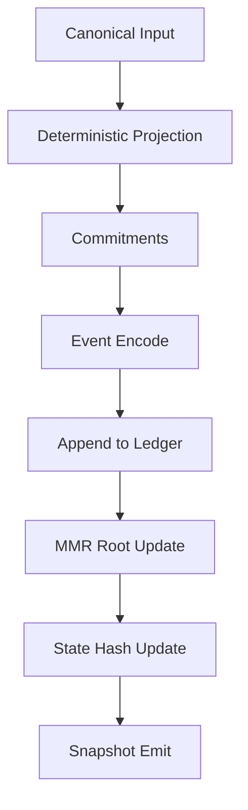

# Engine Flow

```mermaid
flowchart TD
    A[Canonical Input] --> B[Deterministic Projection]
    B --> C[Commitments]
    C --> D[Event Encode]
    D --> E[Append to Ledger]
    E --> F[MMR Root Update]
    F --> G[State Hash Update]
    G --> H[Snapshot Emit]
```
