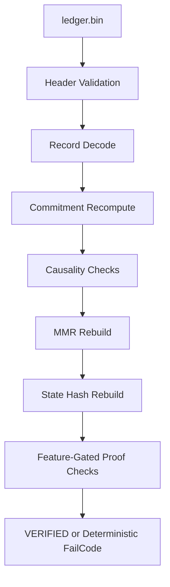

# Replay Verification

```mermaid
flowchart TD
    A[ledger.bin] --> B[Header Validation]
    B --> C[Record Decode]
    C --> D[Commitment Recompute]
    D --> E[Causality Checks]
    E --> F[MMR Rebuild]
    F --> G[State Hash Rebuild]
    G --> H[Feature-Gated Proof Checks]
    H --> I[VERIFIED or Deterministic FailCode]
```
